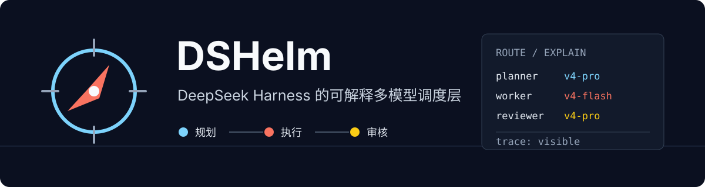
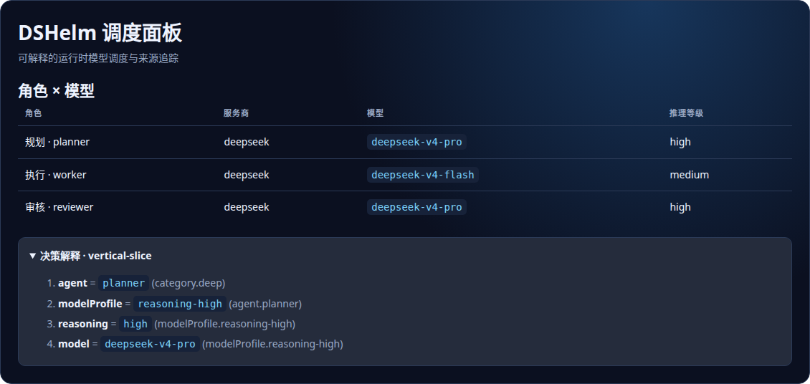

<p align="center">
  
</p>

<p align="center"><a href="README.en.md">English</a> · 简体中文</p>

<p align="center">
  <a href="https://github.com/Altairpaca/dshelm/actions/workflows/ci.yml"></a>
  <a href="LICENSE"></a>
  <a href="https://github.com/topics/dsh-plugin"></a>
  
</p>

> [!IMPORTANT]
> DSHelm 目前是 `0.3.0-alpha` 源码预览版，npm 包尚未发布。当前适合 DSH 插件开发者和愿意反馈早期体验的用户，不建议用于生产环境。

## DSHelm 解决什么问题

当一个任务同时需要强规划、低成本并行执行和独立审核时，固定使用一个模型往往不是最合适的选择。DSHelm 为 [DeepSeek Harness](https://github.com/deepseek-ai/deepseek-harness) 增加一层可解释的调度能力：

- **按能力选择模型**：先检查运行时、认证、上下文和成本等硬条件，再对候选模型排序。
- **让每次选择可追溯**：展示角色、模型、推理等级、覆盖来源和候选淘汰原因。
- **复用 DSH 生态**：使用 DSH 官方扩展接口，不复制会话、工具、工作流或桌面运行时。
- **尊重用户配置**：项目和请求级设置始终可以覆盖 DSHelm 的建议。

一句话概括：**让规划、执行和审核使用合适的模型，并告诉你为什么。**

<p align="center"></p>

## 当前可以体验

| 能力 | 当前状态 | 你能看到什么 |
| --- | --- | --- |
| DSH 原生组合 | 已验证 | 独立 `dshelm` profile 和 `@dshelm/dsh` bundle |
| 模型路由 | Alpha | 硬条件过滤、证据评分、用户策略覆盖 |
| Resolution Trace | Alpha | 每个有效字段的来源和候选决策 |
| 账号发现 | Alpha | API key、provider OAuth 和部分产品登录状态，不复制产品凭据 |
| Web 控制面板 | Alpha | Roles × Models 与最近一次调度解释 |
| OmO 配置迁移 | 预览 | 只读分析，明确标出映射、损失和不支持项 |
| npm 一键安装 | 发布门槛 | 尚未开放，当前只能使用下方源码预览流程 |
| 桌面安装包 | 生态协作 | DSHelm 不另造桌面壳，跟随 DSH 桌面宿主的 profile/plugin 能力 |

## 2026 年 9 月维护进展

当前 `main` 已包含 `0.3.0-alpha` 的认证与模型编排、DSH profile 安装、`doctor` / `explain`、Resolution Trace、Web 控制面板和 OmO 只读迁移能力。下一阶段已经拆成可公开跟踪的社区任务：

| 任务 | 目标 |
| --- | --- |
| [#7 npm alpha](https://github.com/Altairpaca/dshelm/issues/7) | 发布可验证的公共 alpha，并完成 clean-HOME 安装 / 卸载证据 |
| [#8 跨平台安装矩阵](https://github.com/Altairpaca/dshelm/issues/8) | 收集 Linux、macOS Apple Silicon、Windows 11 + WSL2 的可复现安装记录 |
| [#9 首次运行示例](https://github.com/Altairpaca/dshelm/issues/9) | 提供 planner → workers → reviewer 的 credential-light 示例和完整 trace |
| [#10 贡献者入口](https://github.com/Altairpaca/dshelm/issues/10) | 明确 provider/model evidence、平台验证、文档、示例和 bug 的贡献规范 |

当前发布状态仍是**源码预览**。npm 包、三平台完整验证以及可复用首次运行 fixture 均以对应 Issue 的验收条件为准，不提前宣称完成。

### 先看一次可解释路由

不配置 provider 或凭据，也可以先运行离线 fixture，查看 planner、两个 worker 和 reviewer 如何经过同一套 resolver 选择模型并生成 Resolution Trace：

```bash
pnpm example:first-run
```

这个示例只验证**路由与解释契约**，不会调用真实 provider、工具或 agent task。完整说明见 [`examples/README.md`](examples/README.md)。

## 从源码体验

环境要求：Node.js `>=22.19.0`、pnpm `11.7.0`、可在 `PATH` 中调用的 DSH CLI。当前验证版本见 [`compatibility.json`](compatibility.json)。macOS、Linux 或 Windows 11 + WSL2 均可尝试，Windows 原生体验仍待社区验证。

```bash
git clone https://github.com/Altairpaca/dshelm.git
cd dshelm
corepack enable
pnpm install --frozen-lockfile
pnpm preview:init
```

`preview:init` 会构建本地包，并把源码预览安装到 `$DSH_HOME/profiles/dshelm`。它不会自动登录，也不会复制 Codex、Claude 等产品的凭据。

```bash
dsh --profile dshelm --dump-config
node packages/cli/dist/index.js doctor
node packages/cli/dist/index.js auth status
node packages/cli/dist/index.js explain deepseek/deepseek-v4-flash
dsh --profile dshelm
```

卸载会移除项目发现信息和 `dshelm` profile，默认保留凭据：

```bash
node packages/cli/dist/index.js uninstall --yes
```

> [!NOTE]
> npm alpha 发布后的目标入口是 `npx dshelm init --yes`。在 npm 页面真实可用前，文档不会把它写成现有安装方式。

## 它如何工作

```text
任务需求 → 运行时与认证硬条件 → 模型能力与证据评分 → 用户/项目/请求策略覆盖 → DSH 执行 + Resolution Trace
```

DSHelm Core 只负责策略、配置、路由和解释；任务执行仍由 DSH 及其插件完成。详细边界见[架构说明](docs/ARCHITECTURE.md)。

## 社区与兼容性

项目同步维护简体中文和英文文档，并优先把兼容性结论建立在可复现证据上：DSH 版本、DeepSeek/Qwen/本地模型、Linux、macOS、Windows 11 + WSL2，以及密钥、费用、网络和数据位置等边界都应有明确记录。当前计划见[社区版本路线图](docs/community-roadmap.zh-CN.md)，桌面方向见[桌面化策略](docs/desktop.zh-CN.md)。

使用问题和渠道选择见 [`SUPPORT.md`](SUPPORT.md)，贡献流程见 [`CONTRIBUTING.md`](CONTRIBUTING.md)，社区参与规范见 [`CODE_OF_CONDUCT.md`](CODE_OF_CONDUCT.md)。中英文 Issue 和 PR 都欢迎。

## 与 DSH 社区一起演进

DSHelm 是 DSH 生态的一部分，不是 DSH 的替代品。项目会优先在官方 Discussion 中讨论公共接口和可复用契约：

- [模型规划与执行切换 #3297](https://github.com/deepseek-ai/deepseek-harness/discussions/3297)
- [DSH 桌面宿主 #3118](https://github.com/deepseek-ai/deepseek-harness/discussions/3118)
- [`dsh doctor` 社区契约 #1719](https://github.com/deepseek-ai/deepseek-harness/discussions/1719)
- [安全的 CLI provider 与 fallback #3283](https://github.com/deepseek-ai/deepseek-harness/discussions/3283)

欢迎提交一个真实任务、一次安装记录、一个路由结果，或 Windows、WSL2、本地模型和 provider 的验证结果。请使用 [GitHub Issues](https://github.com/Altairpaca/dshelm/issues) 报告可复现问题；涉及 DSH 公共能力的讨论会同步回对应的官方 Discussion。

## 安全与事实边界

- 只有不透明的 `CredentialRef` 会进入策略和 trace；产品自有 secret 仍由产品管理。
- 无法可靠确认的认证状态会显示为 `unknown`，不会猜测为已登录。
- 模型软评分是带来源和置信度的维护者启发式，不是模型排行榜。
- DSHelm 不隶属于 DeepSeek，也不代表文中提到的模型或厂商。

Apache License 2.0。
