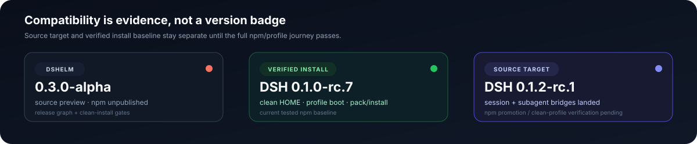
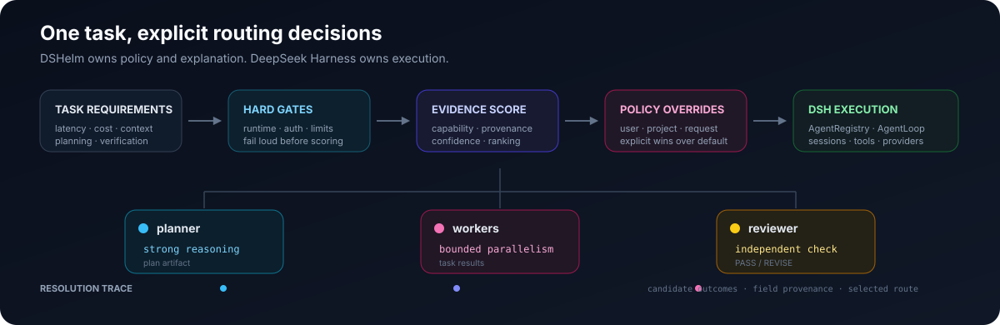

<p align="center">
  
</p>

<p align="center"><a href="README.en.md">English</a> · 简体中文</p>

<p align="center">
  <a href="https://github.com/Altairpaca/dshelm/actions/workflows/ci.yml"></a>
  <a href="LICENSE"></a>
  <a href="https://github.com/topics/dsh-plugin"></a>
  
</p>

<p align="center">
  <a href="#两分钟看懂-dshelm">两分钟看懂</a> ·
  <a href="#零凭据体验">零凭据体验</a> ·
  <a href="#deepseek-harness-兼容性">DSH 兼容性</a> ·
  <a href="#从源码体验">源码安装</a> ·
  <a href="#社区与路线图">社区路线图</a>
</p>

> [!IMPORTANT]
> DSHelm 当前是 `0.3.0-alpha` **源码预览版**，npm 包尚未发布，不建议用于生产环境。项目正在适配 DeepSeek Harness `0.1.2-rc.1`；该版本目前作为 **source target** 跟踪，完整 npm package set 与 clean-profile 验证完成前，不会把它标记为已验证安装基线。

<p align="center">
  
</p>

## 两分钟看懂 DSHelm

DSHelm 是 [DeepSeek Harness](https://github.com/deepseek-ai/deepseek-harness) 上的一层**可解释多模型调度控制面**。它不复制 DSH 的 session、tool、workflow 或 agent runtime；它只负责在执行之前回答三个问题：

1. **这一步应该交给哪个 role / provider / model？**
2. **哪些 runtime、认证、上下文或成本条件排除了其他候选？**
3. **最终选择来自默认策略、用户覆盖，还是当前请求？**

<p align="center">
  
</p>

核心边界很简单：

| DSHelm 负责 | DeepSeek Harness 负责 |
| --- | --- |
| policy、routing、capability evidence | agent lifecycle、session、tool execution |
| provider/model/reasoning selection | provider adapters 与真实模型调用 |
| user/project/request overrides | profile/plugin composition |
| Resolution Trace 与选择解释 | host、Web、Headless、SDK 等执行面 |

**结果是：planner、worker、reviewer 可以使用不同模型，但每一次选择都保留可追溯证据。**

### 真实控制面

<p align="center">
  
</p>

## 零凭据体验

仓库提供两层 deterministic fixture。两者都不需要 provider credential，但证明的东西不同：

```bash
pnpm example:first-run
pnpm example:dsh-execution
```

| 命令 | 真实执行到哪一层 | 明确不证明什么 |
| --- | --- | --- |
| `example:first-run` | DSHelm Core resolver + Resolution Trace | 不执行 DSH agent，不访问 provider |
| `example:dsh-execution` | 真实 DSH `Context` + `AgentRegistry` + `AgentLoop`，执行 planner → bounded workers → reviewer，并检查 actual request route | synthetic LLM adapter，不证明外部网络、OAuth 或模型质量 |

第二个 fixture 会把实际进入 DSH adapter 的 `requestRoutes` 与 DSHelm resolution 逐项比较，因此它可以证明：**路由结果确实进入了真实 DSH request path**。详细输出与证据边界见 [`examples/README.md`](examples/README.md)。

<details>
<summary><strong>为什么保留两个 fixture？</strong></summary>

resolver contract 与 execution contract 是两个不同的故障域。把它们拆开后，routing regression 可以在不启动 agent runtime 的情况下定位；而 execution fixture 专门验证 DSHelm → DSH 的边界，没有必要用真实 API key 才获得可重复证据。

</details>

## 当前能力

| 能力 | 状态 | 当前证据 |
| --- | --- | --- |
| DSH 原生 profile / bundle | Alpha | 独立 `dshelm` profile、`@dshelm/dsh` bundle、clean profile journey |
| 多模型路由 | Alpha | hard gates、evidence scoring、policy overrides |
| Resolution Trace | Alpha | candidate outcome、field provenance、selected route |
| 账号与认证发现 | Alpha | API key / provider OAuth / 部分产品登录状态；不复制产品凭据 |
| Web control plane | Alpha | Roles × Models、最近一次调度解释 |
| planner → workers → reviewer | Alpha | deterministic real-DSH execution fixture |
| OmO 配置迁移 | Preview | 只读分析；SUPPORTED / MAPPED / LOSSY / UNSUPPORTED |
| npm 安装 | Release gate | 尚未公开；[#7](https://github.com/Altairpaca/dshelm/issues/7) 跟踪 |
| 跨平台验证 | Community evidence | Linux / macOS Apple Silicon / Windows 11 + WSL2 持续收集 |

## DeepSeek Harness 兼容性

### 当前状态

DSHelm 的兼容性声明采用两层口径：

- **Verified install baseline — `0.1.0-rc.7`**：已经完成 package/runtime、clean HOME、profile composition、bounded boot、doctor / explain / uninstall 验证。
- **Current source target — `0.1.2-rc.1`**：DeepSeek Harness 于 **2026-09-03** 发布的最新 source release。DSHelm 已针对已确认的 API 变化加入 forward-compatible bridge，但仍等待完整 npm package set 与 clean-profile promotion gate。

当前机器可读状态见 [`compatibility.json`](compatibility.json)。上游 source target 对应 [`dsh-v0.1.2-rc.1`](https://github.com/deepseek-ai/deepseek-harness/releases/tag/dsh-v0.1.2-rc.1)。

### 已处理的 0.1.2 API 变化

| 上游变化 | DSHelm 处理 |
| --- | --- |
| `Session.events` 被 `seq` / `eventAt()` / `snapshotEvents()` 取代 | 新增 session-log compatibility bridge：优先 `snapshotEvents()`，legacy host 回退 `events` |
| `SubagentCapabilities` 新增 `agentOptions` gate | DSHelm provider 在 runtime 声明 `agentOptions: true`，同时保持旧类型可编译 |
| `AgentOptions` 新增 `reasoningEffort` | 新 host 直接获得 reasoning option；legacy host 继续通过 `request/header` seed 恢复 reasoning |
| subagent caller 可显式选择 provider / model / reasoning / max output | DSHelm 保持 policy resolution 为来源，并映射到官方 `agentOptions` seam；max-output policy 尚未宣称实现 |

这里刻意没有直接把所有 package manifest 改成 `0.1.2-rc.1`：上游 npm 发布在 2026-09-03 处于滚动状态，而且 DSHelm 当前 lockfile 仍属于已验证旧基线。**版本 promotion 必须和完整 package availability、lockfile regeneration、fresh install/profile boot 一起完成。**

<details>
<summary><strong>为什么不使用宽泛的“支持 0.1.x”声明？</strong></summary>

DSH 的 session、subagent、client 与 profile seams 在 prerelease 阶段仍会变化。DSHelm 将兼容性拆成具体 seam 与具体证据，避免一个 semver range 暗示并不存在的运行时保证。发布候选的精确流程见 [`docs/RELEASING.md`](docs/RELEASING.md)。

</details>

## 从源码体验

要求：Node.js `>=22.19.0`、pnpm `11.7.0`，以及当前已验证基线对应的 DSH CLI。准备升级到最新 DSH 时请先查看 [`compatibility.json`](compatibility.json)。

```bash
git clone https://github.com/Altairpaca/dshelm.git
cd dshelm
corepack enable
pnpm install --frozen-lockfile
pnpm preview:init
```

`preview:init` 会构建本地 packages，并把源码预览安装到 `$DSH_HOME/profiles/dshelm`；它不会自动登录，也不会复制 Codex、Claude 等产品凭据。

```bash
dsh --profile dshelm --dump-config
node packages/cli/dist/index.js doctor
node packages/cli/dist/index.js auth status
node packages/cli/dist/index.js explain deepseek/deepseek-v4-flash
dsh --profile dshelm
```

卸载默认保留 credentials：

```bash
node packages/cli/dist/index.js uninstall --yes
```

> [!NOTE]
> npm alpha 发布后的目标入口是 `npx dshelm init --yes`。在 registry artifacts 与 clean-install evidence 都真实存在之前，README 不会把它写成当前安装方式。

## 项目结构

```text
@dshelm/core             policy schema · merge · resolver · Resolution Trace
@dshelm/model-knowledge  capability evidence · provenance · confidence
@dshelm/auth             provider/account capability discovery
@dshelm/dsh              DSH adapter · host service · subagent provider · Web client
@dshelm/compat-omo       read-only OmO migration

dshelm                   CLI · init · doctor · auth · explain · uninstall
```

发布 package graph 由 [`release-packages.json`](release-packages.json) 维护，pack/install verification 由 `pnpm qa:pack-install` 复用。详细架构边界见 [`docs/ARCHITECTURE.md`](docs/ARCHITECTURE.md)。

## 社区与路线图

| Issue | 下一阶段 |
| --- | --- |
| [#7 — npm alpha](https://github.com/Altairpaca/dshelm/issues/7) | 完成 DSH dependency promotion、registry publish、clean-HOME install/uninstall evidence |
| [#8 — platform matrix](https://github.com/Altairpaca/dshelm/issues/8) | Linux、macOS Apple Silicon、Windows 11 + WSL2 可复现验证 |
| [#9 — first-run evidence](https://github.com/Altairpaca/dshelm/issues/9) | deterministic execution fixture 已落地；继续补 provider-backed evidence |
| [#10 — contributor entry points](https://github.com/Altairpaca/dshelm/issues/10) | provider/model evidence、平台验证、文档、routing examples、reproducible bugs |

DSHelm 优先复用 DSH 的公共接口，并把通用 interface 问题反馈回上游。相关讨论：

- [模型规划与执行切换 · deepseek-harness discussion #3297](https://github.com/deepseek-ai/deepseek-harness/discussions/3297)
- [DSH 桌面宿主 · discussion #3118](https://github.com/deepseek-ai/deepseek-harness/discussions/3118)
- [`dsh doctor` 社区契约 · discussion #1719](https://github.com/deepseek-ai/deepseek-harness/discussions/1719)
- [CLI provider 与 fallback · discussion #3283](https://github.com/deepseek-ai/deepseek-harness/discussions/3283)

贡献流程见 [`CONTRIBUTING.md`](CONTRIBUTING.md)，使用与支持渠道见 [`SUPPORT.md`](SUPPORT.md)，社区规范见 [`CODE_OF_CONDUCT.md`](CODE_OF_CONDUCT.md)。Issue / PR 可以使用英文或简体中文。

## 安全与事实边界

- 只有不透明 `CredentialRef` 会进入策略和 trace；产品自有 secret 仍由产品管理。
- 无法可靠确认的认证状态显示为 `unknown`，不会猜测为已登录。
- 模型软评分是带来源与置信度的维护者启发式，不是模型排行榜。
- synthetic fixture 只证明 routing / DSH execution contract，不证明外部 provider 的可用性或模型质量。
- DSHelm 是独立社区项目，不隶属于 DeepSeek，也不代表文中提到的模型或厂商。

Apache License 2.0。
